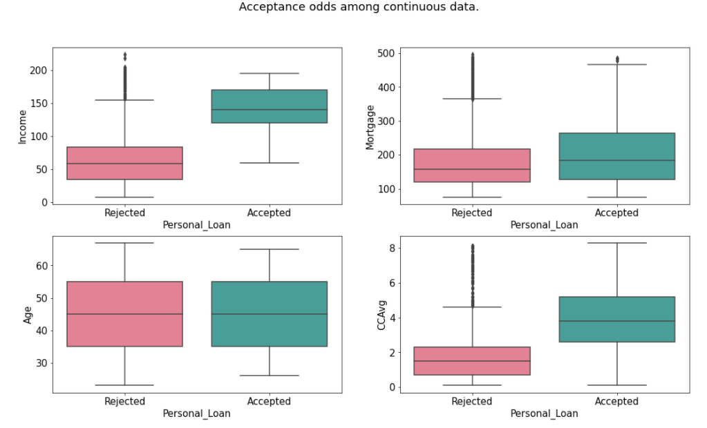
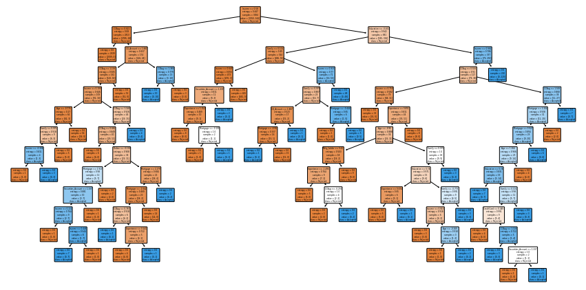
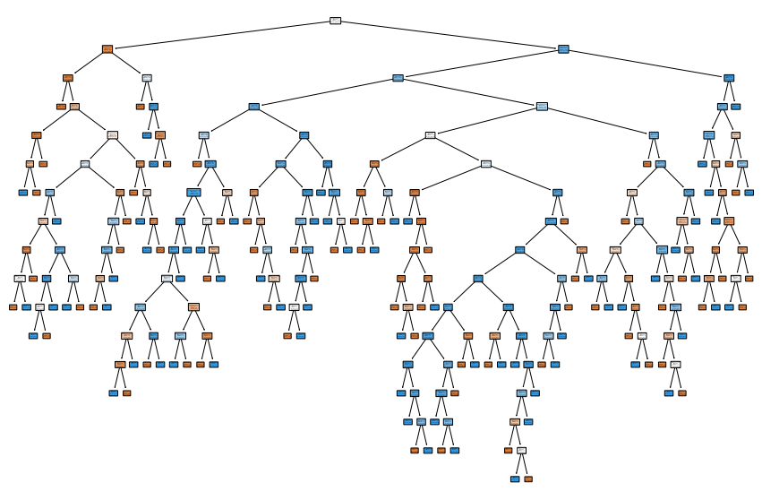
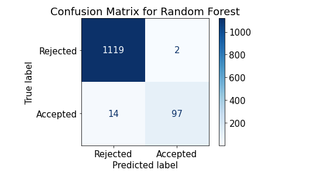
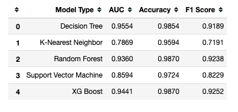
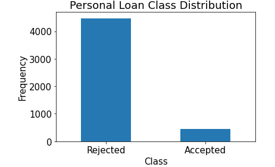
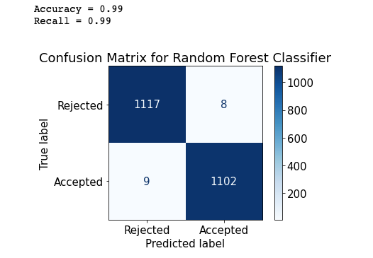
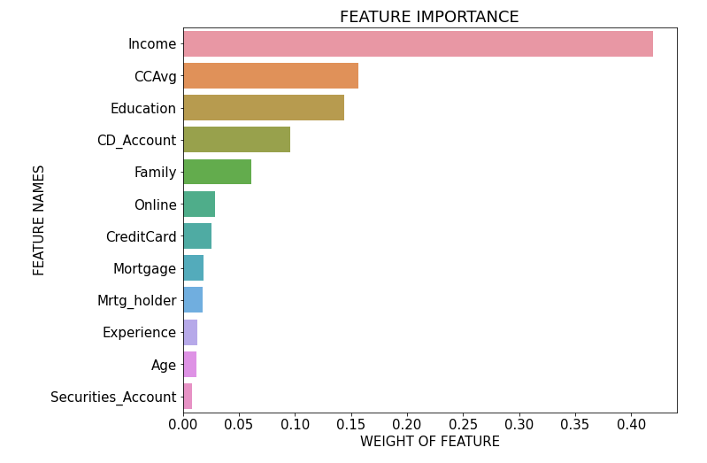

# Project_3
This is a bank loan model created for my third project at flatiron.

## 1 Project Description

### 1.1 The data
|Columns|Descriptions|Type|
|:------|:-----------:|:----|
|ID|Customer ID|Continuous|
|Age|Customer's age in completed years|Continuous|
|Experience|years of professional experience|Continuous|
|Income|Annual income of the customer (thousands)|Continuous|
|ZIPCode|Home Address ZIP code.|Categorical|
|Family|Family size of the customer|Categorical|
|CCAvg|Avg. spending on credit cards per month (thousands)|Continuous|
|Education|Education Level. 1: Undergrad; 2: Graduate; 3: Advanced/Professional|Categorical|
|Mortgage|Value of house mortgage if any. (thousands)|Continuous|
|Personal Loan|Did this customer accept the personal loan offered in the last campaign?|0 = No 1= Yes|
|Securities Account|Does the customer have a securities account with the bank?|0 = No 1= Yes|
|CD Account|Does the customer have a certificate of deposit (CD) account with the bank?|0 = No 1= Yes|
|Online|Does the customer use internet banking facilities?|0 = No 1= Yes|
|CreditCard|Does the customer use a credit card issued by UniversalBank?|0 = No 1= Yes|

First looking at the head of this data and the description of basics like quartiles, mean, and standard deviation, we see that it is a really clean data set. There are no missing values. The minimum and maximum do not stray from the interquartile range too dramatically. We have 5000 entries which is decent. For machine learning it would be preferable for us to have more than this for the model to learn from. The cleanliness of this data set lends itself well, however.

Taking a look below at the histograms for each column or 'feature', it can be observed that our continuous variables include Age, Experience, Income, CCAvg, and Mortgage. Both CCAvg and Mortgage indicate two things:

* The first is many of the rows are ticked with 0. All of those rows indicate people who do not have a Credit Card or Mortgage, respectively.

* The second is the remaining values representing the amount of average credit card expenditure per month and mortgage amount in thousands, respectively.

These seperate issues will be handled in the data cleaning.

The categorical variables include Family and Education.

Finally we have a seies of categorical variables that were yes or no questions represented by 1s and 0s. These include Securities Account, CD Account, Online, and Credit Card.

The final column, Personal Loan, will act as our 'y' variable. The variable we are trying to predict in the future. The important thing to remember about this data set and this project is that Personal loan does NOT measure whether or not someone was approved for a Personal Loan or not. The subjects in this study have already been approved for a Personal Loan and it was recorded if they accepted or not. We are trying to measure the likeliehood that someone will accept the loan offer from this bank.

ID and Zipcode will both be dropped. All of the data essentially comes from the same zipcode so geographic information is irrelavent. If we want to expand the market nationally or internationally then geographic features may become important.

### 1.2 Cleaning the Data
This dataset was relatively easy to work with.  It was very complete and did not have any strange data types or objects.

Mortgage and credit card average need to be split by T/F and continuous data.
Create two new columns:
* The first is replacing any numerical value not 0 with 1.
* The second is using what numerical value there is to create a continuous set of data for Mortage amount and average monthly CC spending

Both the z score and intequantile methods were far too aggressive. Both methods cut the data in half. Removing outliers also killed the Personal_Loan column which is essential to this project.
This was a very clean data set so it is possible they were already removed. However there is the problem of the skew...

The final method that was chosen was to select individual columns, or features, and decide on a reasonable range in which to keep them.  For example on mortgage, although it is heavily skewed to the right, the data is more complete that removing outliers and will not affect our model in a positive or negative way.

### 1.3 The Business Problem

The business problem is to expand the number of 'asset customers' the bank has. This means customers who are paying interst to the bank and there for increasing the bank's overall networth. The idea is to create a machine learning model that will accurately predict the liklihood someone will accept a personal loan. Using this informatino the bank can selectively market their personal loan program and expand their number of 'asset customers'.

## 2 Exploratory Data Analysis

### 2.1 
In this exploratory data analysis I try to explore the obvious relationships.  We assume that the higher someone's income is the higher their mortgage will be.  Digging deeper we assume that more years of experience the higher their income will be.  Finally the more augmented all these factors are, the safer it is to assume that there is a higher monthly credit card bill as well.  We rely on the assumption that all of these factors have specific linear relationships with one another.  

What we want to explore however, is how ALL of these variables affect our final model.

## 3 Building Models

### 3.1 Logistic Regression
Unlike Linear Regression Logistic Regression accounts for Categorical variables.

Logistic regression is easier to implement, interpret, and very efficient to train. If the number of observations is lesser than the number of features, Logistic Regression should not be used, otherwise, it may lead to overfitting. It makes no assumptions about distributions of classes in feature space.

### 3.2 Decision Tree

Trees answer sequential questions which send us down a certain route of the tree given the answer. The model behaves with “if this than that” conditions ultimately yielding a specific result.
Our decision tree was actually right off the bat a well performing model.  It's AUC and accuracy were incredible.

### 3.3 Random Forest

From an article on Towards Data Science:

One way Random Forests reduce variance is by training on different samples of the data. A second way is by using a random subset of features. This means if we have 30 features, random forests will only use a certain number of those features in each model, say five. Unfortunately, we have omitted 25 features that could be useful. But as stated, a random forest is a collection of decision trees. Thus, in each tree we can utilize five random features. If we use many trees in our forest, eventually many or all of our features will have been included. This inclusion of many features will help limit our error due to bias and error due to variance. If features weren’t chosen randomly, base trees in our forest could become highly correlated. This is because a few features could be particularly predictive and thus, the same features would be chosen in many of the base trees. If many of these trees included the same features we would not be combating error due to variance. With that said, random forests are a strong modeling technique and much more robust than a single decision tree. They aggregate many decision trees to limit overfitting as well as error due to bias and therefore yield useful results.

The Random Forest Model along with the Decision Tree is an excellently performing model.  All of its scores are high across the board, our confusion matrix shows a very low false positive rate, and the AUC is very high. 

### 3.4 K-Nearest Neighbor

KNN works by finding the distances between a query and all the examples in the data, selecting the specified number examples (K) closest to the query, then votes for the most frequent label (in the case of classification) or averages the labels (in the case of regression).

Overall our nearest neighbor model with k = 5 performed extremely poorly compared to our other models.  The AUC and F1 score were very low.

### 3.5 Support Vector Machine

A support vector machine takes data points and outputs the hyperplane (which in two dimensions it's simply a line) that best separates the features. This line is the decision boundary: anything that falls to one side of it we will classify as say, 'blue', and anything that falls to the other as 'red'.

This model did not perform well at all.  It was along the lines of K Nearest Neighbor in terms of numbers.  Low AUC, low recall and F1, and a high amount of false negatives.

### 3.6 XG Boost

XGBoost is a popular and efficient open-source implementation of the gradient boosted trees algorithm. When using gradient boosting for regression, the weak learners are regression trees, and each regression tree maps an input data point to one of its leafs that contains a continuous score.

XG Boost performed as well as Decision Tree and Random Forest giving us a 3 way tie!

## 4 What helps us decide which model is best?

### 4.1 Accuracy

Accuracy is the number of correctly predicted data points out of all the data points. ... Often, accuracy is used along with precision and recall, which are other metrics that use various ratios of true/false positives/negatives.

### 4.2 Precision

Precision talks about how precise/accurate your model is out of those predicted positive, how many of them are actual positive.

### 4.3 Recall

Recall actually calculates how many of the Actual Positives our model captures through labeling it as Positive (True Positive).

### 4.4 F1 Score

F1 is a function of Precision and Recall. F1 Score might be a better measure to use if we need to seek a balance between Precision and Recall AND there is an uneven class distribution (large number of Actual Negatives).

Accuracy is used when the True Positives and True negatives are more important while F1-score is used when the False Negatives and False Positives are crucial. ... In most real-life classification problems, imbalanced class distribution exists and thus F1-score is a better metric to evaluate our model on.

### 4.5 Confusion Matrix

In the field of machine learning and specifically the problem of statistical classification, a confusion matrix, also known as an error matrix, is a specific table layout that allows visualization of the performance of an algorithm, typically a supervised learning one.

Our goal result from our confusion matricies is to have:
* Low False Positive
* Moderate to Low False Negative

|Confusion Matrix| |
|:---:|:---:
|True Negative|False Positive|
|False Negative|True Positive|

Or in other words:

|Confusion Matrix| |
|:---:|:---:
|People who actually Declined|People we thought would accept, but declined.|
|People we thought would decline, but accepted.|People who actually accepted.|

It is important to note however, that the top right corner is people who we thought would accept the offer but rejected.  This is the number we want the lowest out of the entire confusion matrix.  Although False Negative is not ideal, we can count on the fact that these customers may learn about the promotion via general advertising.  The idea is to reach as many true positives (or people who will accept the loan offer) and the avoid false positives (people we thought would accept but end up rejecting) as this will be a waste of time and resources.   

### 4.6 ROC and AUC

AUC - ROC curve is a performance measurement for the classification problems at various threshold settings. ROC is a probability curve and AUC represents the degree or measure of separability.  The Higher the AUC, the better the model is at distinguishing between who will accept or not accept the personal loan offer.

## 5 Overall Results

### 5.1 

We are going to go with Random Forest.  XG Boost Performs a little better as far as balancing False Positives and False Negatives.  In the case of this marketing campagin however, we want our false positives to be as low as possible.  This is because any potential client will have money and resources invested in them.  False positives are a waste of time and resources.  False Negatives are not ideal, but there is a likelihood they will discover promotional offers via internet, signs, word of mouth, ext.  Since the Random Forest consistantly produces the lowest number of False Positives it is the winner.  The confusion matrix broke the tie.

## 6 Final Additions

### 6.1 SMOTE - Class Imbalance

As we can see, the one huge problem with our data set is that our dependant variable is grossly imbalanced.  
Although only 9% of the people approved for this loan accepted it is still data worth digging into.
This study was done on a local level but if this were to be expanded to a national or international level you would be talking about tens of thousands of people or more that would be paying interest to the bank.
We are going to handle that with SMOTE.

SMOTE stands for Synthetic Minority Oversampling Technique. This is a statistical technique for increasing the number of cases in your dataset in a balanced way. SMOTE takes the entire dataset as an input, but it increases the percentage of only the minority cases.

### 6.2 Feature Importance
 Feature importance refers to a class of techniques for assigning scores to input features to a predictive model that indicates the relative importance of each feature when making a prediction.
 
 
 
 ## 7 Conclusion
 
 ### 7.1 Suggestions
 
 Based on these results I think it is best that a marketing campagin is created around recent college graduates, post graduate students, people with lots of credit card debt, ext.

After looking up where a lot of the zip codes are, Berkeley CA had a high concentration.  There are over 20 collegate institutions in Berkeley CA.  Therefore our data is geographically biased.

This model can be expanded to a national or world wide market.  I would suggest gathering identical data from all over the country so that we can explore if there are regional trends that change.  For example maybe there are certain parts of the country that Morgage holders are the most likely to accept a personal loan for home renovations.  

### 7.2 Further Work

